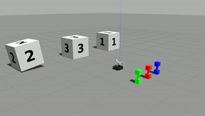
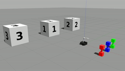
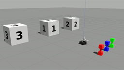

# Robotics Q-Learning Project Implementation Plan
**Partner Names:** Kenneth Humphries, Kailin Wu

## A 1-2 sentence description of how your team plans to implement each of the following components of this project as well as a 1-2 sentence description of how you will test each component:
   
### Q-learning algorithm
-   Executing the Q-learning algorithm
    

We plan to execute the Q-learning algorithm by creating a Q-Matrix and Action Matrix, and update the values inside the Q-Matrix by running the provided phantom_robot_movement.py. To test that our Q-learning algorithm is correct, we may consider printing certain values from the Q-Matrix to console and checking if they are consistent with expectations, perhaps after only a few movements have been made.

-   Determining when the Q-matrix has converged
    

Our algorithm will track whether or not a significant update was made in the Q-Matrix during each iteration of the loop.The Q-Matrix has converged once it stops updating for 10 loops of the algorithm - this number is chosen arbitrarily and we will increase or decrease the number of loops depending on testing. For example, if the robot’s movement takes an inefficient path to reach its destination because the matrix didn’t converge as we had thought, we will increase this number.

Once the Q-matrix has converged, how to determine which actions the robot should take to maximize expected reward

Once the algorithm has converged, the algorithm will track the current state of the field, and choose the action that has the highest reward value based on the corresponding Q-Matrix entry. This behavior can easily be tested with artificial Q reward values to ensure that the robot always chooses the most rewarding path.

### Robot perception
    

-   Determining the identities and locations of the three colored dumbbells
    

The robot will identify the dumbbell’s location with the LiDAR scan and its color with the camera (like the line following exercise.) This can be tested visually - we will run the algorithm and if the robot inaccurately identifies or fails to identify the color of the dumbbell, we will adjust the threshold values of the colors until the robot performs consistently. The location detection can also be tested visually - if the robot moves to pick up a dumbbell and it does not move to the expected position, we will adjust the algorithm. Testing this behavior can be done by manually moving each dumbbell and checking whether the robot can correctly locate them.

-   Determining the identities and locations of the three numbered blocks
    

Determining the location of the three numbered blocks will also be done either with the LiDAR scan or main camera. Determining the identities of these blocks can be done by analyzing the numbers on the blocks, similar to how the color of the dumbbells is analyzed. Alternatively, the identity of the blocks could be determined by placing dumbbells and random blocks and analyzing the change in reward. Ultimately, testing this behavior will be done by manually shifting the blocks and determining whether the robot can correctly locate them.

  

### Robot manipulation & movement
    

-   Picking up and putting down the dumbbells with the OpenMANIPULATOR arm
    

We will find the height and thickness of the grip area on the dumbbell through testing and hard-coded, consistent picking up and putting down motion. This can be tested by watching the robot’s performance in Gazebo. If the robot fails to consistently pick up and put down the dumbbell with the hard-corded algorithm, we may need to customize this motion to account for the robot’s distance and angle away from the dumbbell before it starts the motion. Alternatively, the robot will have to maneuver into a specified distance and angle away from the robot every before it can use the hard-coded motion.

-   Navigating to the appropriate locations to pick up and put down the dumbbells
    

Navigating to the appropriate locations will be done by comparing the robot’s current position (given via the odometry) to the determined location of the dumbbell or block. Essentially, we will create and test a “drive-to-location” method for the robot, which accepts an x, y, and theta value.

  

## A brief timeline sketching out when you would like to have accomplished each
    

Sunday Feb 21 - Finish writing Q-learning algorithm and initial test before robot is moving

Wednesday, Feb 24- Finish creating a module for identifying and locating the dumbbells and blocks.

Friday Feb 26 - Finish robot arm manipulation; robot can consistently pick up and put down a dumbbell at a given location.

Sunday, Feb 28 - Successfully implement all 3 sections of code together.

Monday, March 1- submit project

testing


# HQ-Learning Project

Kenneth Humphries and Kailin Wu

 
## Objectives description:

The goal of this project was to utilize reinforcement learning for the purpose of sorting objects based on a given reward value. Specifically, this project seeks to use a Q-learning algorithm to find the ideal arrangement of three colored dumbbells in front of three numbered blocks. Once this arrangement has been found, the robot must locate and identify each of the colored dumbbells and numbered blocks by their location and relative position. Finally, the robot must actively achieve this ideal state by moving the dumbbells with its mechanical arm.

## High-level description

The entirety of this algorithm can be encompassed into two main python scripts: `q_matrix.py` and `perecption_movement_v2.py`. The rest of the scripts in the directory are simply drafts or test-code. Firstly, `q_matrix` is run and allowed to find the optimal arrangement of the dumbbells in this world. Once this is done, `perecption_movement_v2.py` is run in a separate terminal without closing the q_matrix. This file contains both the full vision processing sequence, as well as what has been completed of the motion controls. Specifically, this program locates all 3 dumbbells by color, as well as all 3 blocks by number, and stores their locations as polar coordinates relative to the robot's starting position. At this point, the `q_matrix.py` script is resumed via user input to publish a sequence of valid moves that the robot can make to achieve an optimal state. At this point, the `perception_movement_v2.py` will listen for these messages and attempt to move the dumbbells accordingly. However, this final behavior does not function fully at the time of writing this.

## Q-learning algorithm description:
### Selecting and executing actions for the robot (or phantom robot) to take

As is the procedure for reinforcement learning, the q-matrix script will continuously take a random, yet valid, action based on the current state of the world. For instance, the algorithm cannot place a dumbbell that has already been placed, or place two dumbbells at the same block. The list of valid actions for each state is ingrained within the q-matrix itself, rather than the action matrix. Ultimately, I found the action matrix to be redundant, as no negative rewards implied that any action with a q-score below zero was not only invalid, but would never be taken. Furthermore, every can only transition to, at most, 9 other states through the list of potential actions. Therefore, a 64x64 did not prove necessary when the 64x9 q-matrix filled the role instead (a helper function, determine_new_state, can find the next state with one sweep of list of states.)
```
if (not self.is_valid_state(self.q_matrix[state])):
	print ("INVALID STATE REACHED")
	break
# Pick a random valid action
action = random.randint(0, 8)
while (self.q_matrix[state][action] == -1):
	action = random.randint(0,8)
```


### Updating the Q-matrix

For this algorithm, I utilized a learning rate of 1 and a discount factor of 0.3 (about ⅓, to represent the number of actions it takes to reach an end state.) For each iteration of the algorithm’s main section, the program takes a random action and determines the new state from the result. The algorithm then sets the value of the original state of the [state][action] index in the q-matrix to the maximum of the next state’s values plus the returned reward. This new value is also published to the appropriate message.

```
new_state = self.determine_new_state(state, action)
maxVal = self.get_max_reward(new_state)
# Wait for reward
while (not self.reward_found):
	r.sleep()
self.q_matrix[state][action] = self.last_reward + gamma * maxVal
```

### Determining when to stop iterating through the Q-learning algorithm

The Q-learning algorithm considers itself to have converged when no notable changes in the matrix have occurred in the last 30 iterations (corresponding to 10 full paths.) “No significant change” is considered to be when the new value of an index is changed by less than 0.05, meaning that the path for this index approaches a set value, at least temporarily. This generally takes 300-500 iterations to occur. There is also a hard cutoff at 666 iterations, enough to ensure that every path has most likely been considered fully.
```
convergence_counter = 30
c = 0
...
temp = self.q_matrix[state][action]
self.q_matrix[state][action] = self.last_reward + gamma * maxVal
...
if (c >= convergence_counter):
	pass
elif (abs(temp - self.q_matrix[state][action]) <= 0.05):
	c += 1
else:
	c = 0
```

### Executing the path most likely to lead to receiving a reward after the Q-matrix has converged on the simulated Turtlebot3 robot

Once the matrix has converged, a method called (get_best_action) is utilized to get the highest-scoring action for any state. This best action is published as a RobotMoveDBToBlock message and the abstract state of the algorithm is updated accordingly. By calling a sequence of 3 “best actions” starting from state zero, this section of the algorithm will provide an optimal sequence of movements for the robot to take.

```
while (not rospy.is_shutdown()):
	input ("The matrix has converged!!! Press Enter to publish the best course of action.")
	for i in range (0, 3):
		p_action = RobotMoveDBToBlock()
		p_action.robot_db = self.a_t[self.best_actions[i]][0]
		p_action.block_id = self.a_t[self.best_actions[i]][1]
		print (p_action.robot_db, p_action.block_id)
		self.action_pub.publish(p_action)
r.sleep()
```

## Robot perception description
###  Identifying the locations and identities of each of the colored dumbbells
This problem is solved using the cv2 module, much like what was done for the line follower lesson.  The algorithm takes a snapshot with the robot's included webcam and searching for red, green, and blue in 3 separate masks. For each of these masks, the dumbbells are marked as with a point represent the average of all points of their respective color in the photo. Doing so allows for the algorithm to find the dumbbells' positions relative to each other, and makes it easier to find their exact locations using the Lidar later in the algorithm.
```
# In detect_dumbbell:
for i in range(0, 3):
	name = ""
	if (i == 0):
		name = "red"
	elif (i == 1):
		name = "green"
	else:
		name = "blue"
	# using moments() function, the center of the yellow pixels is determined
	low, high = colors[i]
	mask = cv2.inRange(hsv, low, high)
	M = cv2.moments(mask)
	if M['m00'] > 0:
		db_count += 1
		# center of the pixels.
		cx = int(M['m10']/M['m00'])
		cy = int(M['m01']/M['m00'])
		# a black circle is visualized in the debugging window to indicate
		# the center point of this dumbell's pixels.
		cv2.circle(self.img, (cx, cy), 20, (0,0,0), -1)
		db_locations.append((cx, cy, name))
...
# In locate_objects:
# Is the lidar finding an object?

scanning = False
# When did the robot start finding an object?
scan_val = 90
# How many objects have we found so far?
counter = 0
# Save the ranges
distances = []
for i in range (90, 450):
	j = i%360
	curr_range = data.ranges[j]
	if (curr_range <= data.range_max):
		# Case 1: Still scanning object...
		if (scanning):
			continue
		# Case 2: Start scanning object...
		else:
			scanning = True
			scan_val = i
	# And so on...
```


### Identifying the locations and identities of each of the numbered blocks
Unlike the dumbbells, the algorithm requires a photo for each individual block, as they do not fit in a single shot from the robot's starting position. To achieve this end, the robot does a full 360 degree turn while taking photos at specific angles. Once this is finished, the algorithm utilizes a module called keras-ocr (https://keras-ocr.readthedocs.io/en/latest/) To perform letter recognition on the three images. This originally took 10-15 seconds, but seems to take upwards of a minute in more recent trials. Finally, the results of this process are used to determine the relative order of the blocks, which assists in finding their exact location later.
```
pipeline = keras_ocr.pipeline.Pipeline()
# Get a set of three example images
images = [
keras_ocr.tools.read(url) for url in [
	"lblock.png",
	"mblock.png",
	"rblock.png"
	]
]
# Each list of predictions in prediction_groups is a list of
# (word, box) tuples.
prediction_groups = pipeline.recognize(images)
# print (prediction_groups)
rospy.sleep(1)
for i in range(0, 3):
	# Get the word result from each image.
	try:
		wordarr, _ = prediction_groups[i]
		word, _ = wordarr
		# Nobody's perfect.
		if (word == 'l'):
			word = '1'
		print (word)
		self.block_order[i] = int(word)
	except (ValueError):
		print ("Robot couldn't recognize every image!")
...
# Finding the locations is done in the same call to locate_objects.
```
## Robot manipulation and movement
The implementation for robot manipulation and movement is in `perception_movement_v2.py`.

During initialization, the robot arm is moved into a default position, an array name default_pos. This position orients the arm so that it doesn’t stick out too far forward.

Moving to the right spot in order to pick up a dumbbell

-   We run the node from `object_recognizer.py` after the world is initialized and when the world is rest. The node stores the order of the blocks from left to right and the dumbbells from left to right, as well as the positions of all 6 of these objects as radian coordinates. In `the function move_to()` in `motion.py`
   
### Picking up the dumbbell
-   Once the robot has oriented itself [] distance in front of the dumbbell,
 
### Moving to the desired destination (numbered block) with the dumbbell

-  As I write this, the motion controls are not complete. If that changes, be sure to update the writeup accordingly!
 *~Kenneth*
    
### Putting the dumbbell back down at the desired destination
- ...
## Challenges (1 paragraph): Describe the challenges you faced and how you overcame them.
One challenge we faced as a team was combining every aspect of the project into a single, cohesive sequence. originally, we attempted to run the vision processing and motion in separate nodes from separate scripts, `object_recognizer.py` and `motion.py` respectively. However, it turned out that we can’t run a node, shut it down, and then start another in the same script. To solve this, we had to combine both of our scripts into `perception_movement.py` (now `perception_movement_v2.py`), making  sure that all the objects were identified and located before attempts to move were made.

Another challenge we faced was finding the optimal convergence condition that balanced correctness with computation time. Ultimately, we discovered that the algorithm would take 300-500 iterations to begin reliably returning an optimal path. For us, this meant counting every time the Q-learning algorithm failed to make a significant change in the matrix for an iteration. If this occurred for 30 iteration in a row, the matrix is considered converged.

## Future Work
For the future, we hope to implement a more robust system for picking up and delivering the dumbbells to the cubes.  Unfortunately, that goal of the project could not be achieved in the time alotted. Furthermore, we would also seek to speed up the performance of both scripts in terms of computation time. Currently, the q_matrix takes over 5 minutes to converge, the vision processing takes over a minute, and motion takes an undetermined amount of time. Such time constraints made it difficult to perform full tests on the algorithm.


Maneuvering the robot forward so that the open grip of the arm goes precisely around the dumbbell handle. It wasn’t precise enough with our original odometry method, so proportional control with the Lidar was also utilized.

## Takeaways (at least 2 bullet points with 2-3 sentences per bullet point): What are your key takeaways from this project that would help you/others in future robot programming assignments working in pairs? For each takeaway, provide a few sentences of elaboration.

- *Kailin*: One takeaway I had was to write test scripts for part and debugging those before combining it with other pieces of code. After I combined the object recognizing and motion scripts, I wasted time by waiting for the object recognition to complete every single time I ran the code to debug motion.
- *Kenneth*: My main takeaway from this project was the fact that a seemingly trivial task for humans requires many individual parts working in harmony for a robot to complete. Ultimately, the careful cooperation between various techniques and functionalities is necessary to complete any complex task for a robot.

Gifs of Behaviour
These 3 gifs occurred in order during a single run of the algorithm.
1) An excerpt of the q_matrix script as it runs.





2) What the robot looks like as it processes visual data.





3) An example of the robot successfully placing a dumbbell in front of the correct block, according to the Q-matrix ("green", 1).





